# F1 Prediction Market Protocol - Complete Project Documentation

## Project Overview

### Core Value Proposition
A **Telegram bot for a decentralized prediction market on Solana** targeting the Formula 1 niche. The platform allows F1 fans to create and bet on race outcomes using a simplified AMM (Automated Market Maker) with native SOL, delivered through an accessible Telegram interface.

### Key Differentiators
- **Blue Ocean Strategy**: Targets F1 fans (millions of non-crypto users) rather than competing in the saturated prediction market space
- **Mobile-First UX**: Telegram bot with embedded wallets removes crypto complexity
- **Social & Gamified**: Makes prediction markets feel like fantasy sports rather than complex DeFi
- **Permissionless**: Anyone can create markets about any F1 event (or other topics)

---

## User Personas & Prioritization

### Primary Users for POC (Priority Order)

1. **F1 Fans and Retail Users**
   - Casual sports fans who want to bet on race outcomes
   - Need simple, intuitive interface with minimal crypto knowledge
   - Motivated by entertainment and proving their F1 knowledge

2. **DeFi Traders**
   - Crypto-native users seeking yield and speculation opportunities
   - Analyze odds, take strategic positions, manage portfolios
   - Bring liquidity and market efficiency

3. **Professional Arbitrageurs**
   - Systematically exploit pricing inefficiencies across platforms
   - Need fast execution and programmatic access
   - Keep markets accurate through arbitrage

4. **Liquidity Providers**
   - Provide initial liquidity to markets and earn trading fees
   - Often market creators themselves
   - Crucial infrastructure for platform functionality

### Secondary Users (Not POC Focus)
- Content creators and influencers
- Platform administrators
- Oracle operators
- Governance participants

---

## Core User Stories

### User Story 1: Market Creator Initializes F1 Race Prediction

**As a** F1 enthusiast who follows the sport closely

**I want to** create a prediction market for "Will Max Verstappen win the Singapore Grand Prix?" with 200 USDC initial liquidity

**So that** other fans can bet on the outcome and I can earn trading fees from the activity while providing a platform for community engagement

**Acceptance Criteria:**
- I enter the market question, set the market close time to 30 minutes before race start, and designate myself as the resolver
- The system creates a new market account on-chain with a unique ID, transfers my 200 USDC to the market vault split equally between YES/NO sides, and returns a shareable market link
- I can immediately see my new market in the "View Markets" list showing 50% YES / 50% NO odds with 200 USDC total liquidity
- My wallet balance decreases by 200 USDC plus transaction fees, and I receive confirmation that I'm the liquidity provider for this market

---

### User Story 2: Casual Fan Places Prediction Bet

**As a** casual F1 fan who believes Verstappen will dominate the Singapore race

**I want to** place a 50 USDC bet on YES for the Verstappen win market

**So that** I can profit from my racing knowledge if my prediction is correct and experience the thrill of having stake in the race outcome

**Acceptance Criteria:**
- I browse the market list and see the Verstappen win market showing current odds of 50% YES / 50% NO
- I click "Bet YES" and select 50 USDC from preset amount buttons, seeing a preview showing my potential return of approximately 95 USDC (1.9x payout) if Verstappen wins
- I receive confirmation that my bet is placed
- The market odds immediately update to reflect my bet (approximately 60% YES / 40% NO due to my 50 USDC shifting the pool balance)
- In "My Positions" I see this bet listed showing market question, YES side, 50 USDC invested, current value, and potential 95 USDC payout if resolved YES

---

### User Story 3: DeFi Trader Takes Opposite Position

**As a** DeFi trader who analyzes odds and seeks arbitrage opportunities

**I want to** place a 100 USDC bet on NO for the Verstappen win market because I believe the 60% YES odds are overvalued

**So that** I can profit from what I perceive as market mispricing and help bring odds closer to true probabilities

**Acceptance Criteria:**
- I see the Verstappen market now shows 60% YES / 40% NO after the previous user's bet
- I click "Bet NO" and enter custom amount of 100 USDC, seeing preview of potential 240 USDC return (2.4x) if Verstappen doesn't win
- The bet executes immediately with minimal slippage shown in the confirmation
- Market odds rebalance to approximately 55% YES / 45% NO reflecting the new liquidity distribution after my large NO position
- My position appears in "My Positions" showing 100 USDC on NO side with current value tracking as odds fluctuate from additional bets

---

### User Story 4: Market Creator Resolves After Race

**As the** market creator and designated resolver after the Singapore GP concludes

**I want to** submit the race outcome that Verstappen did win the race as predicted

**So that** all participants can claim their winnings or losses and the market reaches finalization

**Acceptance Criteria:**
- After the race ends with Verstappen winning, I navigate to my created market and see a "Resolve Market" button available only to me as the designated resolver
- I select the outcome "YES - Verstappen Won"
- The system records the YES outcome on-chain, locks the market from further bets, calculates all winning positions, and updates the market status to "Resolved"
- All participants immediately receive notifications that the market has been resolved with the final outcome
- The market now displays "RESOLVED: YES" prominently with the final odds at time of resolution and total payout pool for winners

---

### User Story 5: Winner Claims Payout

**As the** casual fan who bet 50 USDC on YES and was correct about Verstappen winning

**I want to** claim my winnings from the resolved market

**So that** I can receive my profit and have the funds available in my wallet for future bets or withdrawal

**Acceptance Criteria:**
- I navigate to the "Claim Rewards" section and see the Verstappen market listed showing "You Won! Claimable: 95 USDC"
- I click "Claim" button for this specific market (or use "Claim All" if I have multiple winning positions) and within seconds receive confirmation that 95 USDC has been transferred to my wallet
- My wallet balance increases by 95 USDC (representing my 50 USDC original bet plus 45 USDC profit)
- The market disappears from my "Claim Rewards" section and moves to a "Resolved Positions" history showing my winning bet details and profit earned

---

## Technical Architecture

### Key Architectural Decisions

1. **No Meteora for POC** - Build simplified constant product AMM (x*y=k) directly in the program
2. **Native SOL Only** - No SPL tokens, no USDC for POC, just native SOL
3. **No Position Tokens** - Track positions in PDA state only, no token minting
4. **Separate LP Tracking** - Distinct LP Position PDA for market creators
5. **Pull-Based Settlement** - Users call `claim_payout` themselves to withdraw winnings
6. **Fees on Bet Placement** - Deduct 2% fee immediately on each bet

### Tech Stack

- **Blockchain**: Solana (Devnet for POC, Mainnet for production)
- **Smart Contract Framework**: Anchor (Rust-based)
- **Currency**: Native SOL for all transactions
- **Frontend**: React/Next.js with TypeScript (web interface for POC)
- **Wallet Adapter**: @solana/wallet-adapter for Phantom/Solflare support
- **RPC Provider**: Helius or Quicknode
- **Future Integration**: Telegram Bot API with embedded wallets (post-POC)

---

## Smart Contract Architecture

### Program Instructions

1. **initialize_protocol** - Sets up global configuration
2. **create_market** - Market creator deploys new prediction market
3. **place_bet** - Users bet on YES or NO
4. **resolve_market** - Designated resolver submits outcome
5. **claim_payout** - Winners withdraw their earnings
6. **claim_lp_fees** - Market creators claim accumulated trading fees

### Account Structures

#### Global State PDA
```rust
#[account]
pub struct GlobalState {
    pub market_counter: u64,      // Increments for each new market
    pub fee_rate: u16,             // Basis points (200 = 2%)
    pub protocol_treasury: Pubkey, // Where protocol fees go
    pub admin: Pubkey,             // Admin authority
    pub bump: u8,
}
// Seeds: ["global-state"]
```

#### Market PDA
```rust
#[account]
pub struct Market {
    pub market_id: u64,              // Unique identifier
    pub question: [u8; 200],         // Fixed-size question string
    pub creator: Pubkey,             // Market creator
    pub resolver: Pubkey,            // Designated outcome reporter
    pub yes_pool: u64,               // SOL in YES pool (lamports)
    pub no_pool: u64,                // SOL in NO pool (lamports)
    pub total_liquidity: u64,        // Total SOL in market
    pub state: MarketState,          // Active/Closed/Resolved
    pub outcome: Option<bool>,       // None until resolved
    pub close_time: i64,             // Unix timestamp
    pub resolution_time: Option<i64>,// When resolved
    pub payout_ratio: u64,           // For winners (scaled by 1e9)
    pub bump: u8,
}
// Seeds: ["market", market_id_bytes]
```

#### Position PDA
```rust
#[account]
pub struct Position {
    pub user: Pubkey,           // Bettor's wallet
    pub market: Pubkey,         // Which market
    pub side: bool,             // true=YES, false=NO
    pub amount: u64,            // SOL bet (lamports)
    pub entry_odds: u64,        // Odds when bet placed (scaled)
    pub claimed: bool,          // Prevent double-claim
    pub bump: u8,
}
// Seeds: ["position", market_pubkey, user_pubkey]
```

#### LP Position PDA
```rust
#[account]
pub struct LPPosition {
    pub lp_provider: Pubkey,        // Market creator
    pub market: Pubkey,             // Which market
    pub liquidity_provided: u64,    // Initial SOL provided
    pub fees_earned: u64,           // Accumulated trading fees
    pub fees_claimed: bool,         // Claimed status
    pub fees_claimed_amount: u64,   // How much claimed
    pub bump: u8,
}
// Seeds: ["lp-position", market_pubkey, lp_provider_pubkey]
```

#### Market State Enum
```rust
#[derive(AnchorSerialize, AnchorDeserialize, Clone, PartialEq, Eq)]
pub enum MarketState {
    Active,    // Accepting bets
    Closed,    // Past close_time, no more bets
    Resolved,  // Outcome submitted
    Finalized, // All claims processed (optional)
}
```

---

## Complete User Flow with Backend Details

### Example Scenario: Verstappen Singapore GP Market

**Initial Setup:**
- Alice (market creator): 500 SOL
- Bob (bettor): 50 SOL
- Carol (bettor): 100 SOL
- Protocol Treasury: 0 SOL

---

### Step 1: Alice Creates Market (100 SOL initial liquidity)

**User Action:**
Alice connects wallet, clicks "Create Market", enters:
- Question: "Will Max Verstappen win the Singapore Grand Prix?"
- Initial Liquidity: 100 SOL
- Close Time: September 15, 2024, 2:00 PM
- Resolver: Her own wallet address

**Backend Flow:**
```
Alice's Wallet (500 SOL)
    ↓
Signs create_market transaction
    ↓
├─> Creates Global State PDA (if first market)
├─> Increments market_counter: 0 → 1
├─> Creates Market PDA with market_id: 1
│   ├─> yes_pool: 50 SOL (50,000,000,000 lamports)
│   ├─> no_pool: 50 SOL
│   ├─> state: Active
│   └─> outcome: None
├─> Creates Market Vault (native SOL account)
├─> Creates LP Position PDA for Alice
│   ├─> liquidity_provided: 100 SOL
│   └─> fees_earned: 0 SOL
└─> Transfer 100 SOL: Alice → Market Vault
    (via System Program CPI)
```

**State After Creation:**
- Alice's Wallet: 399.997 SOL (500 - 100 - 0.003 rent/gas)
- Market Vault: 100 SOL
- Market Odds: 50% YES / 50% NO
- Protocol Treasury: 0 SOL

---

### Step 2: Bob Bets 10 SOL on YES

**User Action:**
Bob sees market, clicks "Bet YES", selects 10 SOL, confirms transaction.

**Backend Flow:**
```
Bob's Wallet (50 SOL)
    ↓
Signs place_bet transaction
    ↓
Instruction Handler:
├─> Validates market.state == Active ✓
├─> Validates current_time < close_time ✓
├─> Validates Bob has sufficient balance ✓
│
├─> Calculate Fee: 10 × 0.02 = 0.2 SOL
├─> Net Bet: 10 - 0.2 = 9.8 SOL
│
├─> Transfer 1: 0.2 SOL fee
│   ├─> Protocol share (20%): 0.04 SOL → Treasury
│   └─> LP share (80%): 0.16 SOL → Stays in vault, tracked in LP Position
│
├─> Transfer 2: 9.8 SOL → Market Vault
│   (via System Program CPI)
│
├─> Update Market PDA:
│   ├─> yes_pool: 50 + 9.8 = 59.8 SOL
│   ├─> no_pool: 50 SOL (unchanged)
│   └─> total_liquidity: 109.8 SOL
│
├─> Calculate New Odds:
│   ├─> YES: 59.8 / 109.8 = 54.5%
│   └─> NO: 50 / 109.8 = 45.5%
│
├─> Update Alice's LP Position:
│   └─> fees_earned: 0 + 0.16 = 0.16 SOL
│
└─> Create Bob's Position PDA:
    ├─> side: YES (true)
    ├─> amount: 9.8 SOL
    ├─> entry_odds: 54.5%
    └─> claimed: false
```

**Token Flow Clarification:**
```
Bob sends: 10 SOL total
├─> 0.04 SOL → Protocol Treasury (immediately transferred)
├─> 0.16 SOL → Stays in Market Vault (tracked in Alice's LP Position)
└─> 9.8 SOL → Market Vault (updates YES pool)

Bob receives: NO TOKENS
Bob gets: Position PDA created on-chain (not a token, just account data)
```

**State After Bob's Bet:**
- Bob's Wallet: 39.999 SOL (50 - 10 - 0.001 gas)
- Market Vault: 109.8 SOL (100 + 9.8, the 0.16 LP fee stays here)
- Protocol Treasury: 0.04 SOL
- Alice's LP Position fees_earned: 0.16 SOL
- Market Odds: 54.5% YES / 45.5% NO

**Bob's Position (in PDA, not in his wallet):**
- Bet: 9.8 SOL on YES
- Entry odds: 54.5%
- Potential payout if YES: ~18.0 SOL (calculated from pool ratios)

---

### Step 3: Carol Bets 20 SOL on NO

**User Action:**
Carol clicks "Bet NO", enters 20 SOL, confirms.

**Backend Flow:**
```
Carol's Wallet (100 SOL)
    ↓
Signs place_bet transaction (20 SOL on NO)
    ↓
├─> Fee: 20 × 0.02 = 0.4 SOL
│   ├─> Protocol: 0.08 SOL → Treasury
│   └─> LP: 0.32 SOL → Tracked in Alice's LP Position
│
├─> Net Bet: 19.6 SOL → Market Vault
│
├─> Update Market PDA:
│   ├─> yes_pool: 59.8 SOL (unchanged)
│   ├─> no_pool: 50 + 19.6 = 69.6 SOL
│   └─> total_liquidity: 129.4 SOL
│
├─> New Odds:
│   ├─> YES: 59.8 / 129.4 = 46.2%
│   └─> NO: 69.6 / 129.4 = 53.8%
│
├─> Update Alice's LP Position:
│   └─> fees_earned: 0.16 + 0.32 = 0.48 SOL
│
└─> Create Carol's Position PDA:
    ├─> side: NO (false)
    ├─> amount: 19.6 SOL
    └─> claimed: false
```

**State After Carol's Bet:**
- Carol's Wallet: 79.999 SOL (100 - 20 - 0.001 gas)
- Market Vault: 129.4 SOL (109.8 + 19.6)
- Protocol Treasury: 0.12 SOL (0.04 + 0.08)
- Alice's LP Position fees_earned: 0.48 SOL
- Market Odds: 46.2% YES / 53.8% NO

**Summary of Positions:**
```
YES Pool (59.8 SOL total):
├─> Alice's initial: 50 SOL
└─> Bob's bet: 9.8 SOL

NO Pool (69.6 SOL total):
├─> Alice's initial: 50 SOL
└─> Carol's bet: 19.6 SOL

Total Pool: 129.4 SOL
```

---

### Step 4: Alice Resolves Market (YES wins)

**User Action:**
Race ends, Verstappen wins. Alice clicks "Resolve Market" → "YES - Verstappen Won"

**Backend Flow:**
```
Alice's Wallet
    ↓
Signs resolve_market transaction
    ↓
Instruction Handler:
├─> Validates alice.key == market.resolver ✓
├─> Validates current_time >= close_time ✓
├─> Validates market.state == Active or Closed ✓
│
└─> Update Market PDA:
    ├─> state: Resolved
    ├─> outcome: Some(true) // YES
    ├─> resolution_time: current_timestamp
    │
    └─> Calculate Payout Ratio:
        ├─> Total pool: 129.4 SOL
        ├─> Winning pool (YES): 59.8 SOL
        └─> payout_ratio: 129.4 / 59.8 = 2.164
            (stored as 2,164,000,000 scaled by 1e9)
```

**No SOL transfers happen yet** - this just records the outcome.

**Payout Calculations:**
```
Winners (YES bettors):
├─> Bob: 9.8 SOL × 2.164 = 21.2 SOL
└─> Alice: 50 SOL × 2.164 = 108.2 SOL
    Total YES payouts: 129.4 SOL ✓

Losers (NO bettors):
├─> Carol: 19.6 SOL → Lost
└─> Alice: 50 SOL → Lost
```

**State After Resolution:**
- Market Vault: 129.4 SOL (unchanged, waiting for claims)
- Market State: Resolved
- Outcome: YES
- Payout Ratio: 2.164x
- No transfers yet, winners must claim

---

### Step 5: Bob Claims His Winnings

**User Action:**
Bob sees "You Won! Claim 21.2 SOL", clicks "Claim"

**Backend Flow:**
```
Bob's Wallet (39.999 SOL)
    ↓
Signs claim_payout transaction
    ↓
Instruction Handler:
├─> Fetch Bob's Position PDA
│   ├─> side: YES (true)
│   ├─> amount: 9.8 SOL
│   └─> claimed: false
│
├─> Fetch Market PDA
│   ├─> outcome: Some(true) // YES
│   ├─> payout_ratio: 2.164
│   └─> state: Resolved
│
├─> Validate Bob's side == outcome ✓
├─> Validate !position.claimed ✓
│
├─> Calculate Payout:
│   └─> 9.8 × 2.164 = 21.2 SOL
│
├─> Transfer 21.2 SOL: Market Vault → Bob
│   (via System Program CPI with PDA signer)
│
└─> Update Position PDA:
    └─> claimed: true
```

**PDA Signing for Transfer:**
```rust
// Program must sign on behalf of Market Vault
let market_seeds = &[
    b"market",
    &market.market_id.to_le_bytes(),
    &[market.bump],
];
let signer_seeds = &[&market_seeds[..]];

// CPI with signer
let cpi_ctx = CpiContext::new_with_signer(
    system_program,
    Transfer { from: market_vault, to: bob_wallet },
    signer_seeds,
);
system_program::transfer(cpi_ctx, 21_200_000_000)?; // 21.2 SOL in lamports
```

**State After Bob's Claim:**
- Bob's Wallet: 61.199 SOL (39.999 + 21.2)
- Market Vault: 108.2 SOL (129.4 - 21.2)
- Bob's net profit: 11.2 SOL (112% ROI on his 10 SOL bet)

---

### Step 6: Alice Claims (Two Separate Claims)

**Claim 1: Her Winning YES Position (50 SOL initial liquidity on YES side)**

```
Alice's Wallet
    ↓
Signs claim_payout transaction
    ↓
├─> Her YES position: 50 SOL
├─> Payout: 50 × 2.164 = 108.2 SOL
└─> Transfer: Market Vault → Alice (108.2 SOL)
```

**Claim 2: Her LP Fees**

```
Alice's Wallet
    ↓
Signs claim_lp_fees transaction
    ↓
├─> Fetch LP Position PDA
│   ├─> fees_earned: 0.48 SOL
│   └─> fees_claimed: false
│
├─> Transfer: Market Vault → Alice (0.48 SOL)
│
└─> Update LP Position:
    ├─> fees_claimed: true
    └─> fees_claimed_amount: 0.48 SOL
```

**State After Alice's Claims:**
- Alice's Wallet: 508.677 SOL (399.997 + 108.2 + 0.48)
- Market Vault: ~0 SOL (108.2 - 108.2 - 0.48)
- Alice's Earnings Breakdown:
  - Started with: 500 SOL
  - Spent on market: -100 SOL
  - Won from YES position: +108.2 SOL (her 50 SOL on YES side)
  - Lost from NO position: -50 SOL (her 50 SOL on NO side)
  - Earned as LP: +0.48 SOL (trading fees)
  - Net profit: +8.677 SOL

---

### Final State Summary

```
Bob's Final Balance: 61.199 SOL
├─> Started: 50 SOL
├─> Bet: -10 SOL
├─> Won: +21.2 SOL
└─> Net Profit: +11.2 SOL (112% ROI)

Alice's Final Balance: 508.677 SOL
├─> Started: 500 SOL
├─> Market creation: -100 SOL
├─> Won YES side: +108.2 SOL
├─> Lost NO side: -50 SOL
├─> LP fees: +0.48 SOL
└─> Net Profit: +8.677 SOL (8.7% return)

Carol's Final Balance: 79.999 SOL
├─> Started: 100 SOL
├─> Lost bet: -20 SOL
└─> Net Loss: -20 SOL

Protocol Treasury: 0.12 SOL
├─> Bob's fee (20%): 0.04 SOL
└─> Carol's fee (20%): 0.08 SOL

Market Vault: 0 SOL (fully distributed)
```

**Zero-Sum Verification:**
```
Total money in system: 650 SOL (Alice 500 + Bob 50 + Carol 100)
Total money out: 649.875 SOL (sum of final balances + treasury)
Difference: 0.125 SOL (spent on gas fees and rent)
```

---

## AMM (Automated Market Maker) Logic

### Simplified Pool-Based Odds Calculation

**Formula:**
```
YES_odds = YES_pool / (YES_pool + NO_pool)
NO_odds = NO_pool / (YES_pool + NO_pool)
```

**Example After Bob's Bet:**
```
Initial: YES=50, NO=50, Total=100
├─> YES_odds: 50/100 = 50%
└─> NO_odds: 50/100 = 50%

Bob adds 9.8 to YES pool:
├─> YES_pool: 59.8
├─> NO_pool: 50
├─> Total: 109.8

New Odds:
├─> YES: 59.8/109.8 = 54.5%
└─> NO: 50/109.8 = 45.5%
```

### Payout Calculation at Resolution

**If YES wins:**
```
Payout Ratio = Total Pool / Winning Pool
             = 129.4 / 59.8
             = 2.164x

Each YES bettor gets:
their_bet_amount × 2.164

Bob's payout:
9.8 × 2.164 = 21.2 SOL
```

**Breakdown of Bob's 21.2 SOL:**
```
Bob's original bet: 9.8 SOL (returned)
Bob's share of losing pool (NO):
├─> Bob's % of YES pool: 9.8 / 59.8 = 16.4%
├─> Bob gets 16.4% of entire pot: 0.164 × 129.4 = 21.2 SOL
└─> Profit: 21.2 - 9.8 = 11.4 SOL (from NO bettors)
```

---

## Fee Distribution Mechanism

### Fee Structure
- **Total Trading Fee**: 2% of each bet
- **Split**:
  - 80% to Liquidity Provider (market creator)
  - 20% to Protocol Treasury

### Example: Bob's 10 SOL Bet
```
Total Bet: 10 SOL
Fee (2%): 0.2 SOL
├─> Protocol (20% of fee): 0.04 SOL → Transferred to Treasury immediately
├─> LP/Alice (80% of fee): 0.16 SOL → Stays in vault, tracked in LP Position
└─> Net Bet: 9.8 SOL → Added to YES pool

Transactions:
1. Transfer 0.04 SOL: Bob → Protocol Treasury
2. Transfer 9.8 SOL: Bob → Market Vault
3. Update LP Position: fees_earned += 0.16 SOL
```

**Important Note:**
The LP's fee portion (0.16 SOL) is NOT transferred separately. It stays in the market vault as part of the total pool, but is tracked in the LP Position PDA for later claim. This ensures the vault always has sufficient balance for both bettor payouts and LP fee claims.

---

## Key Technical Details

### No Tokens Involved

**Critical Understanding:**
- Bettors do NOT receive any tokens when they place bets
- NO SPL tokens are minted for YES/NO positions
- Positions are tracked purely in PDA account state
- Users cannot transfer, sell, or trade their positions (unless you build that separately)

**What Bob Actually Gets When He Bets:**
```
Bob's wallet: NO tokens appear
On-chain: Position PDA created storing bet details
└─> This is an ACCOUNT owned by your program, not a token Bob holds
```

**To view positions:**
Frontend queries blockchain for Position PDAs and displays data to users.

### PDA (Program Derived Address) Seeds

**Market PDA:**
```rust
seeds = [b"market", market_id.to_le_bytes()]
```

**Position PDA:**
```rust
seeds = [b"position", market_pubkey.as_ref(), user_pubkey.as_ref()]
```

**LP Position PDA:**
```rust
seeds = [b"lp-position", market_pubkey.as_ref(), lp_provider_pubkey.as_ref()]
```

**Global State PDA:**
```rust
seeds = [b"global-state"]
```

### State Validation Examples

**In place_bet instruction:**
```rust
require!(
    market.state == MarketState::Active,
    ErrorCode::MarketNotActive
);

let clock = Clock::get()?;
require!(
    clock.unix_timestamp < market.close_time,
    ErrorCode::MarketClosed
);

require!(
    user_balance >= bet_amount + gas_buffer,
    ErrorCode::InsufficientBalance
);
```

**In resolve_market instruction:**
```rust
require!(
    *resolver.key == market.resolver,
    ErrorCode::UnauthorizedResolver
);

let clock = Clock::get()?;
require!(
    clock.unix_timestamp >= market.close_time,
    ErrorCode::MarketStillOpen
);

require!(
    market.state != MarketState::Resolved,
    ErrorCode::AlreadyResolved
);
```

**In claim_payout instruction:**
```rust
require!(
    market.state == MarketState::Resolved,
    ErrorCode::NotResolved
);

require!(
    position.side == market.outcome.unwrap(),
    ErrorCode::PositionLost
);

require!(
    !position.claimed,
    ErrorCode::AlreadyClaimed
);
```

### Cross-Program Invocations (CPI)

**Transferring SOL (without PDA signer):**
```rust
// When user bets, transfer from user to vault
use anchor_lang::system_program;

let cpi_ctx = CpiContext::new(
    system_program.to_account_info(),
    system_program::Transfer {
        from: user.to_account_info(),
        to: market_vault.to_account_info(),
    },
);
system_program::transfer(cpi_ctx, amount)?;
```

**Transferring SOL (with PDA signer):**
```rust
// When claiming, program must sign on behalf of vault
let market_seeds = &[
    b"market",
    &market.market_id.to_le_bytes(),
    &[market.bump],
];
let signer_seeds = &[&market_seeds[..]];

let cpi_ctx = CpiContext::new_with_signer(
    system_program.to_account_info(),
    system_program::Transfer {
        from: market_vault.to_account_info(),
        to: user.to_account_info(),
    },
    signer_seeds
    ,
);
system_program::transfer(cpi_ctx, payout_amount)?;
```

### Account Rent Requirements

**Solana Rent Calculation:**
```
Rent per byte = 0.00000348 SOL per year
Standard exemption = 2 years

Market PDA (333 bytes):
= 333 × 0.00000348 × 2
≈ 0.0023 SOL

Position PDA (91 bytes):
≈ 0.0006 SOL

LP Position PDA (98 bytes):
≈ 0.0007 SOL
```

**Who Pays Rent:**
- Market creation: Alice pays ~0.003 SOL (Market + LP Position PDAs)
- First bet: Bob pays ~0.0006 SOL (his Position PDA)
- Subsequent bets: Each new user pays for their Position PDA

**Rent Reclamation (Optional):**
After all claims processed, close market account and reclaim rent to creator or protocol.

---

## Security Considerations

### Preventing Double Claims
```rust
// Check claimed flag before processing
require!(!position.claimed, ErrorCode::AlreadyClaimed);

// After successful transfer
position.claimed = true;
```

### Authorization Checks
```rust
// Only designated resolver can resolve
require!(
    *resolver.key == market.resolver,
    ErrorCode::UnauthorizedResolver
);

// Only position owner can claim (implicit via PDA derivation)
let position_pda = Pubkey::find_program_address(
    &[b"position", market.key().as_ref(), user.key().as_ref()],
    program_id,
);
```

### Integer Overflow Protection
```rust
// Use checked arithmetic
let new_pool = market.yes_pool
    .checked_add(bet_amount)
    .ok_or(ErrorCode::Overflow)?;

// Anchor provides automatic overflow checks in debug mode
market.yes_pool += bet_amount; // Safe with Anchor
```

### Vault Balance Validation
```rust
// Before transferring payout
let vault_balance = market_vault.lamports();
require!(
    vault_balance >= payout_amount,
    ErrorCode::InsufficientVaultBalance
);
```

### Time-Based Validations
```rust
use anchor_lang::solana_program::clock::Clock;

let clock = Clock::get()?;
let current_time = clock.unix_timestamp;

// Can't bet after close time
require!(
    current_time < market.close_time,
    ErrorCode::MarketClosed
);

// Can't resolve before close time
require!(
    current_time >= market.close_time,
    ErrorCode::MarketStillOpen
);
```

---

## Error Handling

### Custom Error Enum
```rust
#[error_code]
pub enum ErrorCode {
    #[msg("Insufficient balance to place bet")]
    InsufficientBalance,
    
    #[msg("Market is not in active state")]
    MarketNotActive,
    
    #[msg("Market has closed, no more bets allowed")]
    MarketClosed,
    
    #[msg("Market is still open, cannot resolve yet")]
    MarketStillOpen,
    
    #[msg("Only designated resolver can resolve this market")]
    UnauthorizedResolver,
    
    #[msg("Market has already been resolved")]
    AlreadyResolved,
    
    #[msg("Market has not been resolved yet")]
    NotResolved,
    
    #[msg("Position has already been claimed")]
    AlreadyClaimed,
    
    #[msg("This position is on the losing side")]
    PositionLost,
    
    #[msg("Insufficient vault balance for payout")]
    InsufficientVaultBalance,
    
    #[msg("Integer overflow in calculation")]
    Overflow,
    
    #[msg("Invalid outcome value")]
    InvalidOutcome,
    
    #[msg("Bet amount below minimum")]
    BetTooSmall,
    
    #[msg("Bet amount above maximum")]
    BetTooLarge,
}
```

---

## Architecture Diagram (Mermaid)

```mermaid
graph TB
    subgraph "User Interfaces"
        USER[User Wallet<br/>Native SOL]
        CREATOR[Market Creator<br/>Native SOL]
        RESOLVER[Designated Resolver]
    end

    subgraph "Prediction Market Program"
        subgraph "Instructions"
            INIT[initialize_protocol]
            CREATE[create_market]
            BET[place_bet]
            RESOLVE[resolve_market]
            CLAIM[claim_payout]
            CLAIMLP[claim_lp_fees]
        end
        
        subgraph "AMM Logic"
            AMM[Constant Product<br/>YES_pool × NO_pool = k]
            ODDS[Odds Calculator<br/>YES% = NO_pool / total]
            FEE[Fee Deduction<br/>2% on each bet]
        end
        
        subgraph "Account State (PDAs)"
            GLOBAL[(Global State PDA<br/>━━━━━━━━<br/>market_counter<br/>fee_rate<br/>treasury_address<br/>admin)]
            
            MARKET[(Market PDA<br/>━━━━━━━━<br/>market_id<br/>question<br/>creator<br/>resolver<br/>YES_pool<br/>NO_pool<br/>state<br/>outcome<br/>close_time<br/>payout_ratio)]
            
            POSITION[(User Position PDA<br/>━━━━━━━━<br/>user<br/>market<br/>side: YES/NO<br/>amount<br/>entry_odds<br/>claimed: bool)]
            
            LPPOS[(LP Position PDA<br/>━━━━━━━━<br/>market_creator<br/>market<br/>liquidity_provided<br/>fees_earned<br/>fees_claimed)]
        end
    end
    
    subgraph "On-Chain Accounts"
        VAULT[Market Vault<br/>Native SOL Account]
        TREASURY[Protocol Treasury<br/>Native SOL Account]
    end
    
    subgraph "Solana System"
        SYSPROG[System Program<br/>SOL Transfers<br/>Account Creation]
        CLOCK[Clock Sysvar<br/>Timestamp Validation]
    end
    
    subgraph "Future Integrations (Optional)"
        METEORA[Meteora DLMM<br/>Advanced Liquidity]
        SWITCHBOARD[Switchboard Oracle<br/>Decentralized Resolution]
    end

    %% Flow 1: Initialize Protocol
    CREATOR -->|1. initialize_protocol| INIT
    INIT -->|Create| GLOBAL
    INIT -->|Set treasury| TREASURY

    %% Flow 2: Create Market
    CREATOR -->|2. create_market<br/>question, liquidity, resolver| CREATE
    CREATE -->|Increment counter| GLOBAL
    CREATE -->|Create| MARKET
    CREATE -->|Create| VAULT
    CREATE -->|Create| LPPOS
    CREATE -->|Transfer SOL<br/>Split 50/50 to pools| VAULT
    CREATE -.->|Use| SYSPROG
    CREATE -.->|Validate time| CLOCK

    %% Flow 3: Place Bet
    USER -->|3. place_bet<br/>market, side, amount| BET
    BET -->|Check state & time| MARKET
    BET -.->|Validate time| CLOCK
    BET -->|Deduct fee| FEE
    FEE -->|2% to treasury| TREASURY
    BET -->|Transfer remaining SOL| VAULT
    BET -->|Update YES or NO pool| MARKET
    BET -->|Calculate new odds| AMM
    AMM -->|Update| ODDS
    BET -->|Create/Update| POSITION
    BET -->|Record fee earned| LPPOS
    BET -.->|Use| SYSPROG

    %% Flow 4: Resolve Market
    RESOLVER -->|4. resolve_market<br/>outcome: YES/NO| RESOLVE
    RESOLVE -->|Verify authority| MARKET
    RESOLVE -.->|Validate time| CLOCK
    RESOLVE -->|Update state<br/>Record outcome<br/>Calculate payout_ratio| MARKET

    %% Flow 5: Claim Payout
    USER -->|5. claim_payout<br/>market| CLAIM
    CLAIM -->|Check position & outcome| POSITION
    CLAIM -->|Check win side| MARKET
    CLAIM -->|Calculate payout| MARKET
    CLAIM -->|Transfer SOL| VAULT
    VAULT -->|Send winnings| USER
    CLAIM -->|Mark claimed| POSITION
    CLAIM -.->|Use| SYSPROG

    %% Flow 6: Claim LP Fees
    CREATOR -->|6. claim_lp_fees<br/>market| CLAIMLP
    CLAIMLP -->|Check fees earned| LPPOS
    CLAIMLP -->|Transfer fees| VAULT
    VAULT -->|Send fees| CREATOR
    CLAIMLP -->|Update fees_claimed| LPPOS
    CLAIMLP -.->|Use| SYSPROG

    %% Future integrations
    AMM -.->|Future: Advanced AMM| METEORA
    RESOLVE -.->|Future: Decentralized| SWITCHBOARD

    %% Styling
    classDef programBox fill:#4A90E2,stroke:#2E5C8A,stroke-width:2px,color:#fff
    classDef accountBox fill:#50C878,stroke:#2D7A4A,stroke-width:2px,color:#fff
    classDef userBox fill:#FFB347,stroke:#CC7A2D,stroke-width:2px,color:#000
    classDef systemBox fill:#9B59B6,stroke:#6C3483,stroke-width:2px,color:#fff
    classDef futureBox fill:#95A5A6,stroke:#5D6D7E,stroke-width:2px,color:#fff,stroke-dasharray: 5 5
    
    class INIT,CREATE,BET,RESOLVE,CLAIM,CLAIMLP,AMM,ODDS,FEE programBox
    class GLOBAL,MARKET,POSITION,LPPOS,VAULT,TREASURY accountBox
    class USER,CREATOR,RESOLVER userBox
    class SYSPROG,CLOCK systemBox
    class METEORA,SWITCHBOARD futureBox
```



---

## POC Scope and Priorities

### Must Have for POC (Core)

1. **Smart Contract (Anchor Program)**
   - All 6 instructions implemented and tested
   - Simplified AMM logic with pool-based odds
   - Native SOL transfers working correctly
   - PDA derivations and account structures
   - Fee distribution mechanism
   - Resolution and claim logic

2. **Basic Web Frontend**
   - Wallet connection (Phantom/Solflare)
   - Create market form
   - Market list view with current odds
   - Place bet interface (YES/NO buttons)
   - View positions dashboard
   - Claim rewards button
   - Simple, functional UI (not polished)

3. **Testing**
   - Unit tests for all instructions
   - Integration tests for complete user flows
   - Test on Solana devnet
   - Verify all calculations are correct
   - Test edge cases (double claims, unauthorized access, etc.)

### Nice to Have (Post-POC)

- Telegram bot integration
- Embedded wallet system
- Social features and leaderboards
- Meteora DLMM integration
- Switchboard oracle integration
- Advanced analytics dashboard
- Mobile-responsive polished UI
- Marketing landing page
- Fiat on-ramps

### Explicitly Out of Scope for POC

- Token-based positions (no SPL tokens)
- Early exit / sell position feature
- Governance and DAO
- Multi-sig security
- Cross-platform arbitrage tools
- API for external integrations
- Dispute resolution system (just use designated resolver)
- Multiple resolver consensus

---

## Implementation Roadmap

### Phase 1: Smart Contract Development (Week 1-2)

**Day 1-3: Project Setup**
- Initialize Anchor project
- Define all account structures
- Set up error codes
- Write basic instruction handlers (empty logic)

**Day 4-7: Core Instructions**
- Implement `initialize_protocol`
- Implement `create_market` with validation
- Implement `place_bet` with fee logic
- Write unit tests for above

**Day 8-10: Resolution Logic**
- Implement `resolve_market`
- Implement `claim_payout` with payout calculation
- Implement `claim_lp_fees`
- Write unit tests

**Day 11-14: Integration Testing**
- Write full user flow tests
- Test edge cases and error conditions
- Deploy to devnet
- Fix bugs and refine

### Phase 2: Frontend Development (Week 3)

**Day 1-2: Setup and Wallet**
- Create Next.js/React project
- Integrate wallet adapter
- Build wallet connection UI
- Test transactions

**Day 3-4: Market Creation**
- Build create market form
- Integrate with smart contract
- Test market creation flow
- Display created markets

**Day 5-6: Betting Interface**
- Build market list component
- Build bet placement interface
- Show odds and potential payouts
- Test betting transactions

**Day 7: Claims and Dashboard**
- Build positions dashboard
- Build claim rewards interface
- Test complete user journey
- Polish and bug fixes

### Phase 3: Testing and Refinement (Week 4)

**Day 1-2: End-to-End Testing**
- Run complete user scenarios
- Test with multiple wallets
- Verify all calculations
- Check gas costs

**Day 3-4: Bug Fixes**
- Fix any discovered issues
- Improve error handling
- Optimize transaction flows
- Add loading states

**Day 5-7: Documentation and Demo**
- Write deployment guide
- Create demo video
- Prepare presentation
- Final testing

---

## Common Pitfalls to Avoid

### 1. Account Size Miscalculation
**Problem:** Not allocating enough space for PDA accounts
**Solution:** Calculate exact byte requirements for all fields, add discriminator (8 bytes)

### 2. Rent Exemption
**Problem:** Not making accounts rent-exempt
**Solution:** Ensure all PDAs are initialized with sufficient lamports for 2-year rent exemption

### 3. PDA Derivation Inconsistency
**Problem:** Using different seeds for creation vs. lookup
**Solution:** Use consistent seed patterns, document all PDA derivations

### 4. Missing Authority Checks
**Problem:** Not validating signer authority
**Solution:** Always check `#[account(signer)]` and validate resolver authority

### 5. Double Claim Vulnerability
**Problem:** Users claiming rewards multiple times
**Solution:** Always check `claimed` flag before processing, set it to true after

### 6. Integer Overflow
**Problem:** Math operations exceeding u64 limits
**Solution:** Use `checked_add`, `checked_mul` or rely on Anchor's overflow protection

### 7. Insufficient Vault Balance
**Problem:** Trying to transfer more SOL than vault contains
**Solution:** Validate vault balance before transfers, track LP fees separately

### 8. Time Validation Issues
**Problem:** Not properly checking Clock for time-based logic
**Solution:** Always use `Clock::get()?.unix_timestamp` for time comparisons

### 9. CPI Signing Problems
**Problem:** Forgetting to sign with PDA when transferring from vault
**Solution:** Use `CpiContext::new_with_signer` with proper bump seeds

### 10. Frontend State Management
**Problem:** UI not updating after transactions
**Solution:** Refetch account data after successful transactions, show loading states

---

## Key Formulas and Calculations

### Odds Calculation
```rust
// Simple pool ratio
let yes_odds = (market.yes_pool * PRECISION) / (market.yes_pool + market.no_pool);
let no_odds = (market.no_pool * PRECISION) / (market.yes_pool + market.no_pool);

// PRECISION = 1_000_000_000 (1e9) for 9 decimal places
// Example: yes_odds = 545_000_000 represents 54.5%
```

### Payout Ratio Calculation
```rust
// At resolution
let total_pool = market.yes_pool + market.no_pool;
let winning_pool = if outcome { market.yes_pool } else { market.no_pool };

let payout_ratio = (total_pool * PRECISION) / winning_pool;
// Example: payout_ratio = 2_164_000_000 represents 2.164x
```

### Individual Payout Calculation
```rust
// When user claims
let payout = (position.amount * market.payout_ratio) / PRECISION;

// Example: 
// position.amount = 9_800_000_000 lamports (9.8 SOL)
// payout_ratio = 2_164_000_000
// payout = (9_800_000_000 * 2_164_000_000) / 1_000_000_000
//        = 21_207_200_000 lamports (21.2072 SOL)
```

### Fee Distribution
```rust
let total_fee = (bet_amount * fee_rate) / 10_000; // fee_rate = 200 for 2%
let protocol_fee = (total_fee * 20) / 100;  // 20% to protocol
let lp_fee = (total_fee * 80) / 100;        // 80% to LP
let net_bet = bet_amount - total_fee;

// Example with 10 SOL bet:
// total_fee = (10_000_000_000 * 200) / 10_000 = 200_000_000 (0.2 SOL)
// protocol_fee = (200_000_000 * 20) / 100 = 40_000_000 (0.04 SOL)
// lp_fee = (200_000_000 * 80) / 100 = 160_000_000 (0.16 SOL)
// net_bet = 10_000_000_000 - 200_000_000 = 9_800_000_000 (9.8 SOL)
```

---

## Testing Checklist

### Unit Tests (Per Instruction)

**initialize_protocol:**
- ✓ Creates Global State PDA correctly
- ✓ Sets correct fee rate and treasury
- ✓ Fails if called twice

**create_market:**
- ✓ Creates Market PDA with correct data
- ✓ Creates Market Vault with correct balance
- ✓ Creates LP Position PDA for creator
- ✓ Increments global market counter
- ✓ Transfers correct amount from creator
- ✓ Fails if insufficient balance
- ✓ Fails if invalid close_time

**place_bet:**
- ✓ Creates Position PDA correctly
- ✓ Transfers correct amounts (fee split + net bet)
- ✓ Updates market pools correctly
- ✓ Updates LP fees_earned correctly
- ✓ Calculates new odds correctly
- ✓ Fails if market closed
- ✓ Fails if insufficient balance
- ✓ Handles multiple bets from same user

**resolve_market:**
- ✓ Records outcome correctly
- ✓ Calculates payout_ratio correctly
- ✓ Changes state to Resolved
- ✓ Fails if not designated resolver
- ✓ Fails if called before close_time
- ✓ Fails if already resolved

**claim_payout:**
- ✓ Transfers correct payout amount
- ✓ Marks position as claimed
- ✓ Fails if position on losing side
- ✓ Fails if already claimed
- ✓ Fails if market not resolved
- ✓ Fails if insufficient vault balance

**claim_lp_fees:**
- ✓ Transfers correct fee amount
- ✓ Marks LP position as claimed
- ✓ Fails if no fees earned
- ✓ Fails if already claimed

### Integration Tests (Full Scenarios)

**Happy Path:**
1. Create market → place multiple bets → resolve → all winners claim → all losers can't claim → LP claims fees
2. Verify all SOL balances add up correctly
3. Verify zero-sum game (minus fees and gas)

**Edge Cases:**
- Market with only YES bets (all initial liquidity goes to YES winners)
- Market with zero additional bets (only creator's liquidity)
- Very large bet relative to pool (high slippage)
- Many small bets from different users
- Attempting to bet after close_time
- Attempting to resolve before close_time
- Double claim attempts
- Unauthorized resolution attempts

### Frontend Tests

- Wallet connection works with Phantom and Solflare
- Create market form validates inputs correctly
- Bet buttons calculate preview amounts correctly
- Transactions show proper loading states
- Success/error messages display correctly
- Account data refreshes after transactions
- Multiple markets display correctly
- Position dashboard shows accurate data
- Claim buttons only appear for winners

---

## Deployment Guide

### Devnet Deployment

**Prerequisites:**
```bash
# Install Solana CLI
sh -c "$(curl -sSfL https://release.solana.com/stable/install)"

# Install Anchor
cargo install --git https://github.com/coral-xyz/anchor avm --locked --force
avm install latest
avm use latest

# Configure for devnet
solana config set --url https://api.devnet.solana.com
```

**Generate Keypairs:**
```bash
# Program keypair
solana-keygen new -o target/deploy/prediction_market-keypair.json

# Admin/treasury keypair
solana-keygen new -o admin-keypair.json

# Airdrop SOL for testing
solana airdrop 5 $(solana-keygen pubkey admin-keypair.json)
```

**Build and Deploy:**
```bash
# Build program
anchor build

# Deploy to devnet
anchor deploy --provider.cluster devnet

# Note the program ID, update in lib.rs and Anchor.toml
```

**Initialize Protocol:**
```bash
# Create initialization script or use frontend
anchor run initialize --provider.cluster devnet
```

### Mainnet Deployment (Future)

**Security Audit Required:**
- Complete smart contract audit by reputable firm
- Fix all discovered vulnerabilities
- Implement recommended improvements

**Preparation:**
- Set up multi-sig for admin authority
- Configure proper fee rates for production
- Set up monitoring and alerting
- Create incident response plan
- Prepare user documentation

**Deployment:**
```bash
solana config set --url https://api.mainnet-beta.solana.com
anchor deploy --provider.cluster mainnet

# Initialize with production parameters
# Transfer admin authority to multi-sig
```

---

## Questions for Clarification (If Needed)

### Business/Product Questions
1. What should minimum bet amount be? (Prevent spam/dust)
2. What should maximum bet amount be? (Prevent manipulation)
3. Should there be a minimum liquidity requirement for market creation?
4. How should dispute resolution work in production? (For POC, just trust resolver)
5. Should there be any market creation fee?

### Technical Questions
1. Should Position PDAs support multiple bets from same user on same side? (Aggregate or separate?)
2. Should markets automatically close accounts after full distribution? (Reclaim rent?)
3. What precision should be used for odds/payout calculations? (Suggested: 1e9)
4. Should there be slippage protection parameters on bets?
5. How should front-running be mitigated? (Not critical for POC)

---

## Success Metrics for POC

### Technical Metrics
- All instructions work correctly on devnet
- Zero critical bugs in smart contract
- Gas costs under 0.01 SOL per transaction
- Accurate odds calculations
- Correct payout distributions
- All edge cases handled properly

### User Experience Metrics
- Can create market in < 30 seconds
- Can place bet in < 10 seconds
- Wallet connection works smoothly
- Clear feedback on all actions
- Intuitive navigation
- Works on desktop browsers

### Demonstration Goals
- Show complete market lifecycle
- Multiple users interacting with same market
- Correct winner/loser determination
- Fee distribution working
- LP earning fees
- Professional presentation

---

## Next Steps After POC

### If POC Successful

**Phase 1: Polish & Security**
- Professional UI/UX design
- Smart contract audit
- Gas optimization
- Error handling improvements
- Add slippage protection

**Phase 2: Feature Expansion**
- Telegram bot integration
- Embedded wallet system
- Early exit / position trading
- Social features (sharing, leaderboards)
- Multiple resolver consensus
- Dispute resolution mechanism

**Phase 3: Advanced Features**
- Meteora DLMM integration (better liquidity)
- Switchboard oracle integration (decentralized resolution)
- Multi-outcome markets (not just binary)
- Combination bets
- Live in-race predictions

**Phase 4: Go-to-Market**
- F1 community marketing
- Partnership with F1 content creators
- Liquidity mining incentives
- Mobile app development
- Fiat on-ramps

### Scaling Considerations
- Indexing infrastructure (GraphQL API for querying)
- Caching layer for faster UI
- Analytics dashboard for creators
- Admin tools for market moderation
- Automated market maker parameter tuning

---

## Appendix: Code Snippets

### Anchor Program Structure

```rust
// lib.rs
use anchor_lang::prelude::*;
use anchor_lang::system_program;

declare_id!("YourProgramIDHere");

#[program]
pub mod prediction_market {
    use super::*;

    pub fn initialize_protocol(
        ctx: Context<InitializeProtocol>,
        fee_rate: u16,
    ) -> Result<()> {
        let global_state = &mut ctx.accounts.global_state;
        global_state.market_counter = 0;
        global_state.fee_rate = fee_rate;
        global_state.protocol_treasury = ctx.accounts.protocol_treasury.key();
        global_state.admin = ctx.accounts.admin.key();
        global_state.bump = *ctx.bumps.get("global_state").unwrap();
        Ok(())
    }

    pub fn create_market(
        ctx: Context<CreateMarket>,
        question: [u8; 200],
        initial_liquidity: u64,
        close_time: i64,
    ) -> Result<()> {
        let global_state = &mut ctx.accounts.global_state;
        let market = &mut ctx.accounts.market;
        let lp_position = &mut ctx.accounts.lp_position;

        // Increment market counter
        global_state.market_counter += 1;
        let market_id = global_state.market_counter;

        // Initialize market
        market.market_id = market_id;
        market.question = question;
        market.creator = ctx.accounts.creator.key();
        market.resolver = ctx.accounts.creator.key(); // Default to creator
        market.yes_pool = initial_liquidity / 2;
        market.no_pool = initial_liquidity / 2;
        market.total_liquidity = initial_liquidity;
        market.state = MarketState::Active;
        market.outcome = None;
        market.close_time = close_time;
        market.resolution_time = None;
        market.payout_ratio = 0;
        market.bump = *ctx.bumps.get("market").unwrap();

        // Initialize LP position
        lp_position.lp_provider = ctx.accounts.creator.key();
        lp_position.market = market.key();
        lp_position.liquidity_provided = initial_liquidity;
        lp_position.fees_earned = 0;
        lp_position.fees_claimed = false;
        lp_position.fees_claimed_amount = 0;
        lp_position.bump = *ctx.bumps.get("lp_position").unwrap();

        // Transfer initial liquidity
        system_program::transfer(
            CpiContext::new(
                ctx.accounts.system_program.to_account_info(),
                system_program::Transfer {
                    from: ctx.accounts.creator.to_account_info(),
                    to: ctx.accounts.market_vault.to_account_info(),
                },
            ),
            initial_liquidity,
        )?;

        Ok(())
    }

    pub fn place_bet(
        ctx: Context<PlaceBet>,
        side: bool,  // true = YES, false = NO
        amount: u64,
    ) -> Result<()> {
        let market = &mut ctx.accounts.market;
        let position = &mut ctx.accounts.position;
        let lp_position = &mut ctx.accounts.lp_position;
        let global_state = &ctx.accounts.global_state;

        // Validations
        require!(
            market.state == MarketState::Active,
            ErrorCode::MarketNotActive
        );

        let clock = Clock::get()?;
        require!(
            clock.unix_timestamp < market.close_time,
            ErrorCode::MarketClosed
        );

        // Calculate fees
        let total_fee = (amount * global_state.fee_rate as u64) / 10_000;
        let protocol_fee = (total_fee * 20) / 100;
        let lp_fee = (total_fee * 80) / 100;
        let net_bet = amount - total_fee;

        // Transfer protocol fee
        system_program::transfer(
            CpiContext::new(
                ctx.accounts.system_program.to_account_info(),
                system_program::Transfer {
                    from: ctx.accounts.user.to_account_info(),
                    to: ctx.accounts.protocol_treasury.to_account_info(),
                },
            ),
            protocol_fee,
        )?;

        // Transfer net bet to vault
        system_program::transfer(
            CpiContext::new(
                ctx.accounts.system_program.to_account_info(),
                system_program::Transfer {
                    from: ctx.accounts.user.to_account_info(),
                    to: ctx.accounts.market_vault.to_account_info(),
                },
            ),
            net_bet,
        )?;

        // Update pools
        if side {
            market.yes_pool += net_bet;
        } else {
            market.no_pool += net_bet;
        }
        market.total_liquidity += net_bet;

        // Update LP fees
        lp_position.fees_earned += lp_fee;

        // Initialize or update position
        if position.amount == 0 {
            // New position
            position.user = ctx.accounts.user.key();
            position.market = market.key();
            position.side = side;
            position.amount = net_bet;
            position.claimed = false;
            position.bump = *ctx.bumps.get("position").unwrap();
        } else {
            // Existing position (aggregate)
            require!(
                position.side == side,
                ErrorCode::CannotBetBothSides
            );
            position.amount += net_bet;
        }

        // Calculate entry odds (stored for reference)
        let total = market.yes_pool + market.no_pool;
        position.entry_odds = if side {
            (market.yes_pool * 1_000_000_000) / total
        } else {
            (market.no_pool * 1_000_000_000) / total
        };

        Ok(())
    }

    pub fn resolve_market(
        ctx: Context<ResolveMarket>,
        outcome: bool,  // true = YES won, false = NO won
    ) -> Result<()> {
        let market = &mut ctx.accounts.market;

        // Validations
        require!(
            ctx.accounts.resolver.key() == &market.resolver,
            ErrorCode::UnauthorizedResolver
        );

        let clock = Clock::get()?;
        require!(
            clock.unix_timestamp >= market.close_time,
            ErrorCode::MarketStillOpen
        );

        require!(
            market.state != MarketState::Resolved,
            ErrorCode::AlreadyResolved
        );

        // Update market state
        market.state = MarketState::Resolved;
        market.outcome = Some(outcome);
        market.resolution_time = Some(clock.unix_timestamp);

        // Calculate payout ratio
        let total_pool = market.yes_pool + market.no_pool;
        let winning_pool = if outcome {
            market.yes_pool
        } else {
            market.no_pool
        };

        market.payout_ratio = (total_pool * 1_000_000_000) / winning_pool;

        Ok(())
    }

    pub fn claim_payout
    (
        ctx: Context<ClaimPayout>,
    ) -> Result<()> {
        let market = &ctx.accounts.market;
        let position = &mut ctx.accounts.position;

        // Validations
        require!(
            market.state == MarketState::Resolved,
            ErrorCode::NotResolved
        );

        require!(
            position.side == market.outcome.unwrap(),
            ErrorCode::PositionLost
        );

        require!(
            !position.claimed,
            ErrorCode::AlreadyClaimed
        );

        // Calculate payout
        let payout = (position.amount * market.payout_ratio) / 1_000_000_000;

        // Validate vault has sufficient balance
        require!(
            ctx.accounts.market_vault.lamports() >= payout,
            ErrorCode::InsufficientVaultBalance
        );

        // Transfer payout (program must sign)
        let market_seeds = &[
            b"market",
            &market.market_id.to_le_bytes(),
            &[market.bump],
        ];
        let signer_seeds = &[&market_seeds[..]];

        system_program::transfer(
            CpiContext::new_with_signer(
                ctx.accounts.system_program.to_account_info(),
                system_program::Transfer {
                    from: ctx.accounts.market_vault.to_account_info(),
                    to: ctx.accounts.user.to_account_info(),
                },
                signer_seeds,
            ),
            payout,
        )?;

        // Mark as claimed
        position.claimed = true;

        Ok(())
    }

    pub fn claim_lp_fees(
        ctx: Context<ClaimLPFees>,
    ) -> Result<()> {
        let market = &ctx.accounts.market;
        let lp_position = &mut ctx.accounts.lp_position;

        // Validations
        require!(
            lp_position.fees_earned > 0,
            ErrorCode::NoFeesToClaim
        );

        require!(
            !lp_position.fees_claimed,
            ErrorCode::AlreadyClaimed
        );

        let fees_to_claim = lp_position.fees_earned;

        // Validate vault has sufficient balance
        require!(
            ctx.accounts.market_vault.lamports() >= fees_to_claim,
            ErrorCode::InsufficientVaultBalance
        );

        // Transfer fees (program must sign)
        let market_seeds = &[
            b"market",
            &market.market_id.to_le_bytes(),
            &[market.bump],
        ];
        let signer_seeds = &[&market_seeds[..]];

        system_program::transfer(
            CpiContext::new_with_signer(
                ctx.accounts.system_program.to_account_info(),
                system_program::Transfer {
                    from: ctx.accounts.market_vault.to_account_info(),
                    to: ctx.accounts.lp_provider.to_account_info(),
                },
                signer_seeds,
            ),
            fees_to_claim,
        )?;

        // Mark as claimed
        lp_position.fees_claimed = true;
        lp_position.fees_claimed_amount = fees_to_claim;

        Ok(())
    }
}

// Context Structs

#[derive(Accounts)]
pub struct InitializeProtocol<'info> {
    #[account(
        init,
        payer = admin,
        space = 8 + GlobalState::INIT_SPACE,
        seeds = [b"global-state"],
        bump
    )]
    pub global_state: Account<'info, GlobalState>,
    
    /// CHECK: Treasury account for protocol fees
    pub protocol_treasury: AccountInfo<'info>,
    
    #[account(mut)]
    pub admin: Signer<'info>,
    
    pub system_program: Program<'info, System>,
}

#[derive(Accounts)]
pub struct CreateMarket<'info> {
    #[account(mut)]
    pub global_state: Account<'info, GlobalState>,
    
    #[account(
        init,
        payer = creator,
        space = 8 + Market::INIT_SPACE,
        seeds = [b"market", &(global_state.market_counter + 1).to_le_bytes()],
        bump
    )]
    pub market: Account<'info, Market>,
    
    #[account(
        init,
        payer = creator,
        space = 8 + LPPosition::INIT_SPACE,
        seeds = [b"lp-position", market.key().as_ref(), creator.key().as_ref()],
        bump
    )]
    pub lp_position: Account<'info, LPPosition>,
    
    /// CHECK: Vault for holding market SOL
    #[account(mut)]
    pub market_vault: AccountInfo<'info>,
    
    #[account(mut)]
    pub creator: Signer<'info>,
    
    pub system_program: Program<'info, System>,
}

#[derive(Accounts)]
pub struct PlaceBet<'info> {
    pub global_state: Account<'info, GlobalState>,
    
    #[account(mut)]
    pub market: Account<'info, Market>,
    
    #[account(
        init_if_needed,
        payer = user,
        space = 8 + Position::INIT_SPACE,
        seeds = [b"position", market.key().as_ref(), user.key().as_ref()],
        bump
    )]
    pub position: Account<'info, Position>,
    
    #[account(mut)]
    pub lp_position: Account<'info, LPPosition>,
    
    /// CHECK: Market vault
    #[account(mut)]
    pub market_vault: AccountInfo<'info>,
    
    /// CHECK: Protocol treasury
    #[account(
        mut,
        address = global_state.protocol_treasury
    )]
    pub protocol_treasury: AccountInfo<'info>,
    
    #[account(mut)]
    pub user: Signer<'info>,
    
    pub system_program: Program<'info, System>,
}

#[derive(Accounts)]
pub struct ResolveMarket<'info> {
    #[account(mut)]
    pub market: Account<'info, Market>,
    
    #[account(
        constraint = resolver.key() == &market.resolver @ ErrorCode::UnauthorizedResolver
    )]
    pub resolver: Signer<'info>,
}

#[derive(Accounts)]
pub struct ClaimPayout<'info> {
    pub market: Account<'info, Market>,
    
    #[account(
        mut,
        seeds = [b"position", market.key().as_ref(), user.key().as_ref()],
        bump = position.bump
    )]
    pub position: Account<'info, Position>,
    
    /// CHECK: Market vault
    #[account(
        mut,
        seeds = [b"market", &market.market_id.to_le_bytes()],
        bump = market.bump
    )]
    pub market_vault: AccountInfo<'info>,
    
    #[account(mut)]
    pub user: Signer<'info>,
    
    pub system_program: Program<'info, System>,
}

#[derive(Accounts)]
pub struct ClaimLPFees<'info> {
    pub market: Account<'info, Market>,
    
    #[account(
        mut,
        seeds = [b"lp-position", market.key().as_ref(), lp_provider.key().as_ref()],
        bump = lp_position.bump
    )]
    pub lp_position: Account<'info, LPPosition>,
    
    /// CHECK: Market vault
    #[account(
        mut,
        seeds = [b"market", &market.market_id.to_le_bytes()],
        bump = market.bump
    )]
    pub market_vault: AccountInfo<'info>,
    
    #[account(mut)]
    pub lp_provider: Signer<'info>,
    
    pub system_program: Program<'info, System>,
}

// Account Structs

#[account]
#[derive(InitSpace)]
pub struct GlobalState {
    pub market_counter: u64,
    pub fee_rate: u16,
    pub protocol_treasury: Pubkey,
    pub admin: Pubkey,
    pub bump: u8,
}

#[account]
#[derive(InitSpace)]
pub struct Market {
    pub market_id: u64,
    pub question: [u8; 200],
    pub creator: Pubkey,
    pub resolver: Pubkey,
    pub yes_pool: u64,
    pub no_pool: u64,
    pub total_liquidity: u64,
    pub state: MarketState,
    pub outcome: Option<bool>,
    pub close_time: i64,
    pub resolution_time: Option<i64>,
    pub payout_ratio: u64,
    pub bump: u8,
}

#[account]
#[derive(InitSpace)]
pub struct Position {
    pub user: Pubkey,
    pub market: Pubkey,
    pub side: bool,
    pub amount: u64,
    pub entry_odds: u64,
    pub claimed: bool,
    pub bump: u8,
}

#[account]
#[derive(InitSpace)]
pub struct LPPosition {
    pub lp_provider: Pubkey,
    pub market: Pubkey,
    pub liquidity_provided: u64,
    pub fees_earned: u64,
    pub fees_claimed: bool,
    pub fees_claimed_amount: u64,
    pub bump: u8,
}

// Enums

#[derive(AnchorSerialize, AnchorDeserialize, Clone, PartialEq, Eq, InitSpace)]
pub enum MarketState {
    Active,
    Closed,
    Resolved,
    Finalized,
}

// Error Codes

#[error_code]
pub enum ErrorCode {
    #[msg("Insufficient balance to place bet")]
    InsufficientBalance,
    
    #[msg("Market is not in active state")]
    MarketNotActive,
    
    #[msg("Market has closed, no more bets allowed")]
    MarketClosed,
    
    #[msg("Market is still open, cannot resolve yet")]
    MarketStillOpen,
    
    #[msg("Only designated resolver can resolve this market")]
    UnauthorizedResolver,
    
    #[msg("Market has already been resolved")]
    AlreadyResolved,
    
    #[msg("Market has not been resolved yet")]
    NotResolved,
    
    #[msg("Position has already been claimed")]
    AlreadyClaimed,
    
    #[msg("This position is on the losing side")]
    PositionLost,
    
    #[msg("Insufficient vault balance for payout")]
    InsufficientVaultBalance,
    
    #[msg("Integer overflow in calculation")]
    Overflow,
    
    #[msg("Cannot bet on both sides")]
    CannotBetBothSides,
    
    #[msg("No fees to claim")]
    NoFeesToClaim,
}
```

### Frontend Integration Example

```typescript
// src/contexts/PredictionMarketContext.tsx
import { useConnection, useWallet } from '@solana/wallet-adapter-react';
import { Program, AnchorProvider, web3, BN } from '@project-serum/anchor';
import { PublicKey, SystemProgram } from '@solana/web3.js';
import idl from './idl/prediction_market.json';

const PROGRAM_ID = new PublicKey('YourProgramIDHere');

export const usePredictionMarket = () => {
  const { connection } = useConnection();
  const wallet = useWallet();

  const getProvider = () => {
    const provider = new AnchorProvider(
      connection,
      wallet as any,
      { commitment: 'confirmed' }
    );
    return provider;
  };

  const getProgram = () => {
    const provider = getProvider();
    return new Program(idl as any, PROGRAM_ID, provider);
  };

  // Create Market
  const createMarket = async (
    question: string,
    initialLiquidity: number,
    closeTime: number
  ) => {
    const program = getProgram();
    
    // Convert question to fixed-size array
    const questionBytes = new Uint8Array(200);
    const encoder = new TextEncoder();
    const encoded = encoder.encode(question);
    questionBytes.set(encoded.slice(0, 200));

    // Get global state PDA
    const [globalStatePDA] = await PublicKey.findProgramAddress(
      [Buffer.from('global-state')],
      program.programId
    );

    // Get global state to find next market ID
    const globalState = await program.account.globalState.fetch(globalStatePDA);
    const nextMarketId = globalState.marketCounter.toNumber() + 1;

    // Get market PDA
    const [marketPDA] = await PublicKey.findProgramAddress(
      [
        Buffer.from('market'),
        new BN(nextMarketId).toArrayLike(Buffer, 'le', 8)
      ],
      program.programId
    );

    // Get LP position PDA
    const [lpPositionPDA] = await PublicKey.findProgramAddress(
      [
        Buffer.from('lp-position'),
        marketPDA.toBuffer(),
        wallet.publicKey!.toBuffer()
      ],
      program.programId
    );

    // Market vault (just a separate account)
    const marketVault = web3.Keypair.generate();

    const tx = await program.methods
      .createMarket(
        Array.from(questionBytes),
        new BN(initialLiquidity * web3.LAMPORTS_PER_SOL),
        new BN(closeTime)
      )
      .accounts({
        globalState: globalStatePDA,
        market: marketPDA,
        lpPosition: lpPositionPDA,
        marketVault: marketVault.publicKey,
        creator: wallet.publicKey!,
        systemProgram: SystemProgram.programId,
      })
      .signers([marketVault])
      .rpc();

    return { txSignature: tx, marketId: nextMarketId, marketPDA };
  };

  // Place Bet
  const placeBet = async (
    marketPDA: PublicKey,
    side: boolean, // true = YES, false = NO
    amount: number
  ) => {
    const program = getProgram();

    // Get global state PDA
    const [globalStatePDA] = await PublicKey.findProgramAddress(
      [Buffer.from('global-state')],
      program.programId
    );

    const globalState = await program.account.globalState.fetch(globalStatePDA);

    // Get market
    const market = await program.account.market.fetch(marketPDA);

    // Get position PDA
    const [positionPDA] = await PublicKey.findProgramAddress(
      [
        Buffer.from('position'),
        marketPDA.toBuffer(),
        wallet.publicKey!.toBuffer()
      ],
      program.programId
    );

    // Get LP position PDA
    const [lpPositionPDA] = await PublicKey.findProgramAddress(
      [
        Buffer.from('lp-position'),
        marketPDA.toBuffer(),
        market.creator.toBuffer()
      ],
      program.programId
    );

    // Get market vault
    const [marketVaultPDA] = await PublicKey.findProgramAddress(
      [
        Buffer.from('market'),
        market.marketId.toArrayLike(Buffer, 'le', 8)
      ],
      program.programId
    );

    const tx = await program.methods
      .placeBet(side, new BN(amount * web3.LAMPORTS_PER_SOL))
      .accounts({
        globalState: globalStatePDA,
        market: marketPDA,
        position: positionPDA,
        lpPosition: lpPositionPDA,
        marketVault: marketVaultPDA,
        protocolTreasury: globalState.protocolTreasury,
        user: wallet.publicKey!,
        systemProgram: SystemProgram.programId,
      })
      .rpc();

    return tx;
  };

  // Get all markets
  const getAllMarkets = async () => {
    const program = getProgram();
    const markets = await program.account.market.all();
    return markets;
  };

  // Get user positions
  const getUserPositions = async () => {
    const program = getProgram();
    const positions = await program.account.position.all([
      {
        memcmp: {
          offset: 8, // Skip discriminator
          bytes: wallet.publicKey!.toBase58(),
        },
      },
    ]);
    return positions;
  };

  // Resolve Market
  const resolveMarket = async (marketPDA: PublicKey, outcome: boolean) => {
    const program = getProgram();

    const tx = await program.methods
      .resolveMarket(outcome)
      .accounts({
        market: marketPDA,
        resolver: wallet.publicKey!,
      })
      .rpc();

    return tx;
  };

  // Claim Payout
  const claimPayout = async (marketPDA: PublicKey) => {
    const program = getProgram();

    const market = await program.account.market.fetch(marketPDA);

    const [positionPDA] = await PublicKey.findProgramAddress(
      [
        Buffer.from('position'),
        marketPDA.toBuffer(),
        wallet.publicKey!.toBuffer()
      ],
      program.programId
    );

    const [marketVaultPDA] = await PublicKey.findProgramAddress(
      [
        Buffer.from('market'),
        market.marketId.toArrayLike(Buffer, 'le', 8)
      ],
      program.programId
    );

    const tx = await program.methods
      .claimPayout()
      .accounts({
        market: marketPDA,
        position: positionPDA,
        marketVault: marketVaultPDA,
        user: wallet.publicKey!,
        systemProgram: SystemProgram.programId,
      })
      .rpc();

    return tx;
  };

  return {
    createMarket,
    placeBet,
    getAllMarkets,
    getUserPositions,
    resolveMarket,
    claimPayout,
  };
};
```

### React Component Example

```typescript
// src/components/MarketCard.tsx
import React from 'react';
import { PublicKey } from '@solana/web3.js';
import { usePredictionMarket } from '../contexts/PredictionMarketContext';

interface MarketCardProps {
  market: {
    publicKey: PublicKey;
    account: {
      marketId: number;
      question: Uint8Array;
      yesPool: number;
      noPool: number;
      state: any;
      closeTime: number;
    };
  };
}

export const MarketCard: React.FC<MarketCardProps> = ({ market }) => {
  const { placeBet } = usePredictionMarket();
  const [betAmount, setBetAmount] = React.useState(1);
  const [loading, setLoading] = React.useState(false);

  // Decode question from bytes
  const question = new TextDecoder().decode(market.account.question).replace(/\0/g, '');

  // Calculate odds
  const totalPool = market.account.yesPool + market.account.noPool;
  const yesOdds = ((market.account.yesPool / totalPool) * 100).toFixed(1);
  const noOdds = ((market.account.noPool / totalPool) * 100).toFixed(1);

  const handleBet = async (side: boolean) => {
    setLoading(true);
    try {
      const tx = await placeBet(market.publicKey, side, betAmount);
      alert(`Bet placed! Transaction: ${tx}`);
    } catch (error) {
      console.error('Error placing bet:', error);
      alert('Failed to place bet');
    } finally {
      setLoading(false);
    }
  };

  return (
    <div className="market-card">
      <h3>Market #{market.account.marketId}</h3>
      <p className="question">{question}</p>
      
      <div className="odds">
        <div className="odds-box yes">
          <span>YES</span>
          <span className="percentage">{yesOdds}%</span>
        </div>
        <div className="odds-box no">
          <span>NO</span>
          <span className="percentage">{noOdds}%</span>
        </div>
      </div>

      <div className="liquidity">
        Total Liquidity: {(totalPool / 1e9).toFixed(2)} SOL
      </div>

      <div className="bet-controls">
        <input
          type="number"
          value={betAmount}
          onChange={(e) => setBetAmount(Number(e.target.value))}
          min="0.1"
          step="0.1"
        />
        <button onClick={() => handleBet(true)} disabled={loading}>
          Bet YES
        </button>
        <button onClick={() => handleBet(false)} disabled={loading}>
          Bet NO
        </button>
      </div>

      <div className="meta">
        <span>Closes: {new Date(market.account.closeTime * 1000).toLocaleString()}</span>
        <span>State: {Object.keys(market.account.state)[0]}</span>
      </div>
    </div>
  );
};
```

---

## Summary

This documentation provides a complete specification for building an F1-focused prediction market protocol on Solana. The key points are:

### Architecture
- **Simple AMM**: Pool-based odds calculation (not complex Meteora integration for POC)
- **Native SOL**: No token minting, positions tracked in PDAs
- **Pull-based claims**: Users withdraw winnings themselves
- **Fee split**: 2% total (80% LP, 20% protocol)

### User Experience
- Market creators provide initial liquidity and earn trading fees
- Bettors place YES/NO bets and claim winnings if correct
- Designated resolvers submit outcomes after events conclude
- Simple, wallet-connected web interface

### Technical Implementation
- 6 core Anchor instructions
- 4 PDA account types (Global State, Market, Position, LP Position)
- System Program CPIs for SOL transfers
- Clock sysvar for time validation
- Comprehensive error handling

### POC Success Criteria
- All instructions working on devnet
- Multiple users can interact with same market
- Accurate calculations and payouts
- Clean, functional frontend
- Complete market lifecycle demonstration

This provides everything needed to implement the protocol and serves as a reference for future development phases including Telegram integration, Meteora liquidity, and advanced features.